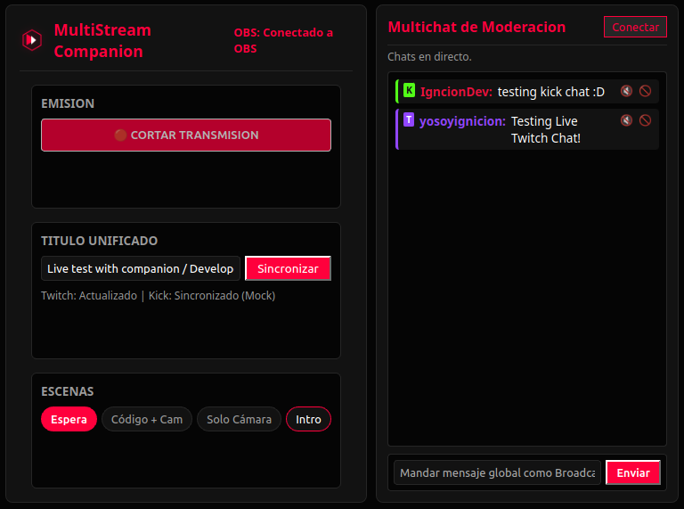

<picture>
  <source media="(prefers-color-scheme: dark)" srcset="https://readme-typing-svg.herokuapp.com?font=Fira+Code&weight=600&size=28&pause=1000&color=FF003C&width=600&lines=MultiStream+Companion;Unifica.+Transmite.+Domina.">
  
</picture>

<p align="center">
  <strong>Aplicación de escritorio para gestionar tu transmisión multi‑plataforma desde una sola ventana</strong>
</p>

<p align="center">
  
  
  
  
  <a href="LICENSE"></a>
</p>

---

## ✦ Que es MultiStream Companion?

MultiStream Companion es una aplicacion de escritorio **gratuita y open-source** que centraliza las herramientas que todo streamer necesita:

- **Multichat unificado** — Lee y escribe mensajes en Twitch y Kick desde una sola ventana
- **Control remoto de OBS Studio** — Cambia escenas, inicia o corta tu streaming sin altabear
- **Sincronizacion de titulo** — Actualiza el titulo de tu directo en todas las plataformas con un solo clic
- **Moderacion centralizada** — Timeout y ban desde el mismo panel de chat

Esta construida con **Tauri v2** (Rust) y **Svelte 5** (TypeScript), lo que la hace ligera, rapida y nativa en Windows, macOS y Linux.

---

```
███████╗████████╗██████╗ ███████╗ █████╗ ███╗   ███╗███████╗██████╗
██╔════╝╚══██╔══╝██╔══██╗██╔════╝██╔══██╗████╗ ████║██╔════╝██╔══██╗
███████╗   ██║   ██████╔╝█████╗  ███████║██╔████╔██║█████╗  ██████╔╝
╚════██║   ██║   ██╔══██╗██╔══╝  ██╔══██║██║╚██╔╝██║██╔══╝  ██╔══██╗
███████║   ██║   ██║  ██║███████╗██║  ██║██║ ╚═╝ ██║███████╗██║  ██║
╚══════╝   ╚═╝   ╚═╝  ╚═╝╚══════╝╚═╝  ╚═╝╚═╝     ╚═╝╚══════╝╚═╝  ╚═╝
```

<p align="center">
  <strong>MultiStream Companion</strong> · <code>v0.1.0</code> · <a href="LICENSE">MIT</a>
</p>

---

## ✦ Captura de pantalla



*Panel principal con control de OBS, sincronizacion de titulo y multichat en vivo.*

---

## ✦ Requisitos para usar la app

### Para ejecutar el binario compilado

Solo necesitas descargar el archivo correspondiente a tu sistema desde [Releases](https://github.com/tuusuario/multistream-companion/releases). No requiere instalar Node.js, Rust ni nada adicional.

### Para compilar desde el codigo fuente

- **Node.js** 20+ y **pnpm**
- **Rust** toolchain (via rustup)
- **Linux:** `sudo apt install libwebkit2gtk-4.1-dev libappindicator3-dev librsvg2-dev patchelf libsecret-1-dev`

---

## ✦ Primeros pasos

### 1. Descarga o compila

```bash
# Si quieres compilar desde el codigo:
pnpm install
python3 generate_logo.py    # genera el icono 512×512
pnpm tauri icon ./app-icon.png
pnpm tauri dev              # lanza la app en modo desarrollo
```

### 2. Configura tus cuentas

Haz clic en el **logotipo** (esquina superior izquierda) para abrir el panel de **Ajustes**. Ahi deberas introducir las credenciales de cada plataforma. Abajo te explicamos exactamente donde obtener cada una.

---

## ✦ Guia de configuracion: donde obtener cada credencial

### Twitch Client-ID

```
https://dev.twitch.tv/console/apps
```

1. Inicia sesion con tu cuenta de Twitch
2. Haz clic en **"Register Your Application"**
3. Pon cualquier nombre (ej: "MultiStream Companion")
4. En **OAuth Redirect URLs** escribe `http://localhost`
5. Categoria: `Application Integration`
6. Crea la app y copia el **Client ID** (texto alfanumerico como `abcdef1234567890abcdef`)
7. Pegalo en Ajustes > **Twitch Client-ID**

### Twitch OAuth Token (token de acceso)

```
https://twitchtokengenerator.com/
```

> **Importante:** La app no incluye un flujo OAuth integrado (no abre un navegador por ti). Debes generar el token manualmente.

1. Abre el enlace de arriba
2. Haz clic en **"Generate Token"**
3. Asegurate de que incluya estos permisos (scopes):
   - `chat:read` — para leer el chat via IRC
   - `user:write:chat` — para enviar mensajes al chat via Helix API
   - `channel:manage:broadcast` — para cambiar el titulo del directo
   - `moderator:manage:banned_users` — para moderacion (timeout/ban)
4. Copia el token que empieza con `oauth:` (ej: `oauth:xxxxxxxxxxxxxxxxxxxxxxxxxxxxxx`)
5. Pegalo en Ajustes > **Twitch OAuth Token**

> Alternativa oficial: puedes generar tu token desde la consola de desarrollador de Twitch usando el **Implicit Code Flow**:
> ```
> https://id.twitch.tv/oauth2/authorize?response_type=token&client_id=TU_CLIENT_ID&redirect_uri=http://localhost&scope=chat:read+user:write:chat+channel:manage:broadcast+moderator:manage:banned_users
> ```

### Kick Chatroom ID

Normalmente la app **detecta automaticamente** tu chatroom ID solo con introducir tu **Kick Username**. Si falla la deteccion automatica:

1. Abre tu canal de Kick en el navegador
2. Abre las herramientas de desarrollador (F12) > pestana **Network**
3. Recarga la pagina y busca la peticion a `https://kick.com/api/v1/channels/tu_usuario`
4. En la respuesta JSON busca el campo `chatroom.id` (es un numero como `12345`)
5. Pegalo en Ajustes > **Kick Chatroom ID (Bypass)**

### OBS Studio

1. Abre **OBS Studio**
2. Ve a **Tools > WebSocket Server Settings**
3. Activa **"Enable WebSocket server"**
4. Puerto por defecto: `4455` (debe coincidir con el de la app)
5. Opcional: activa autenticacion y pon una contrasena
6. En Ajustes de la app:
   - **OBS Host:** `127.0.0.1` (mismo PC) o la IP local (ej: `192.168.1.100`)
   - **OBS Port:** `4455`
   - **OBS Password:** la contrasena que pusiste (o vacio si no usas autenticacion)

### Transmision multi‑plataforma con Restream.io

OBS Studio solo puede transmitir a **un destino RTMP** a la vez. Para emitir en Twitch y Kick simultaneamente sin duplicar carga en tu PC:

1. Crea una cuenta gratuita en **[Restream.io](https://restream.io)** o **StreamElements**
2. En la plataforma, vincula tus canales de Twitch y Kick
3. Copia la **URL RTMP unica** y la **Clave de transmision** que te dan
4. En OBS Studio > Ajustes > Transmision, selecciona "Servicio Personalizado" y pega esos valores
5. La app funciona igual: al pulsar **INICIAR DIRECTO**, OBS envia una sola senal a Restream y ellos la replican a Twitch + Kick

>**Ventaja:** tu PC solo codifica y sube **un** stream, no dos. Consumo de CPU y ancho de banda minimo.

---

### Donde se guarda cada cosa

| Credencial | Donde se almacena | Campo |
|---|---|---|
| Twitch Client-ID | Archivo JSON (`~/.config/com.msc.app/config.json`) | `twitch_client_id` |
| Kick Username | Archivo JSON | `kick_username` |
| Kick Chatroom ID | Archivo JSON | `kick_chatroom_id` |
| OBS Host / Port | Archivo JSON | `obs_host`, `obs_port` |
| **Twitch OAuth Token** | Llavero del sistema (keyring) | `twitch_oauth_token` |
| **OBS Password** | Llavero del sistema (keyring) | `obs_password` |

Las credenciales sensibles (tokens y contrasenas) se guardan en el llavero seguro de tu sistema operativo, no en texto plano.

---

## ✦ Como usar la app

Una vez configurado todo:

1. **Ajustes** → clic en el logotipo para abrir el panel y escribir tus credenciales
2. **Conectar OBS** → boton grande "Conectar con OBS Studio"
3. **Conectar Chat** → boton "Conectar" en el panel de multichat
4. **Controlar tu stream:**
   - Cambia de escena con los botones del panel de escenas
   - Inicia o corta tu streaming con el boton rojo/verde
   - Escribe un titulo y haz clic en "Sincronizar" para actualizarlo en Twitch
5. **Moderar** → usa los botones 🔇 (timeout) y 🚫 (ban) junto a cada mensaje

---

## ✦ Arquitectura

```
┌─ Frontend (Svelte 5 / TypeScript) ─────────────────────┐
│  src/                                                    │
│  ├── main.ts                 ← arranque de la app        │
│  ├── App.svelte              ← componente principal UI   │
│  ├── lib/                                                │
│  │   ├── types.ts             ← tipos compartidos TS↔Rust│
│  │   ├── stores/chat.svelte.ts ← store reactivo del chat│
│  │   └── components/          ← componentes Svelte       │
│  └── (build/)                 ← salida de produccion     │
└──────────────────────────────────────────────────────────┘
         │ IPC (invoke / events)
         ▼
┌─ Backend (Rust) ────────────────────────────────────────┐
│  src-tauri/src/                                          │
│  ├── main.rs               ← builder Tauri, comandos     │
│  ├── config/                ← config JSON + keyring      │
│  ├── obs/                   ← WebSocket OBS (crate obws) │
│  ├── chat/                                             │
│  │   ├── twitch.rs           ← IRC + Helix API          │
│  │   └── kick.rs             ← Pusher WebSocket v2      │
│  └── services/                                          │
│      └── stream_info.rs      ← metadatos Twitch Helix   │
└──────────────────────────────────────────────────────────┘
```

**Flujo de IPC:**
- Frontend llama a `invoke('comando', ...)` → Rust `#[tauri::command]` → respuesta
- Rust emite `app_handle.emit("chat-message", ...)` → frontend `listen('chat-message', ...)` → ChatStore

---

## ✦ Funcionalidades

| Area | Que puedes hacer |
|---|---|
| **Multichat** | Leer y escribir mensajes en Twitch (IRC + Helix API) y Kick (Pusher WebSocket v2) desde un solo feed unificado |
| **Control OBS** | Conectar, listar escenas, cambiar de escena, iniciar/detener streaming |
| **Titulo unificado** | Actualizar el titulo en Twitch (Helix PATCH) y Kick (mock) con un clic |
| **Moderacion** | Timeout y ban desde el mismo panel de chat |
| **Credenciales seguras** | Tokens y contrasenas protegidos en el llavero del sistema operativo |

---

## ✦ Branding

```
  ██  Deep Black   #050505
  ██  Crimson Red  #FF003C
  ██  Pure White   #FFFFFF
```

---

## ✦ Notas para desarrolladores

| Comando | Que hace |
|---|---|
| `pnpm dev` | Frontend solo (Vite en `:1420`, HMR en `:1421`) |
| `pnpm build` | Compila frontend a `build/` |
| `pnpm tauri dev` | Tauri + Vite juntos |
| `pnpm tauri build` | Compila el binario final |
| `pnpm eslint src/` | Lint JS/TS/Svelte |
| `cargo fmt -p multistream-companion` | Formatea Rust |
| `python3 generate_logo.py` | Genera el icono 512×512 |

- ESLint + Prettier estan configurados pero **sin npm script** — ejecutar manualmente
- La app usa **Svelte 5 plano** (sin SvelteKit) con runes `$state` / `$derived` / `$effect`
- El archivo `.github/workflows/publish.yml` automatiza el build multi‑plataforma al pushear a la rama `release`

---

## ✦ Licencia

**MIT** — Ver archivo [LICENSE](LICENSE) para mas detalles.

---

<p align="center">
  <sub>Construido con</sub><br>
  <a href="https://v2.tauri.app"></a>
  <a href="https://svelte.dev"></a>
  <a href="https://www.rust-lang.org"></a>
</p>
